# AI Cordon Picket 1.0.0

slice `all` · 16800 unique injections / 63000 clean · dataset `3ee970d160449aae`

## AI Cordon Picket: the measured profile

| metric | its own point (FPR 0.098%) | what it means |
|---|---|---|
| recall | 16.4% · CI 15.8–17.0 | share of the injections it caught (16800 unique ones) |
| false positives | 0.098% | how often it flags a clean document — 0.1% is one false alarm per 1000 clean documents, 1% is one per 100 (63000 clean documents) |
| coverage | 8.7% · 8 of 92 | in how many of the 92 attack types it catches at least half |
| range over types | 0%–75% | worst attack type to best — how much the average depends on which types you feed it |
| weakest lever | bare 7.3% | the construction it handles worst; what is left if the attacker picks it |
| weakest objective | manipulate 7.8% | the goal it handles worst, same reading |

## False positives by carrier

| carrier | FPR | 95% CI |
|---|---|---|
| doc | 0.119% | 0.1–0.2 |
| email | 0.067% | 0.0–0.1 |
| web | 0.110% | 0.1–0.2 |

## Lever x objective

The same grid per carrier, then pooled. A dot is a pair the grid does not admit.

## AI Cordon Picket against the others, at one false-positive rate

Every detector here was placed at **0.098%** false positives — the rate `picket` its own verdict produces. The guests were re-thresholded to it from their saved scores; `picket` itself was not moved. Binary detectors are absent and cannot be added: two systems at two self-chosen rates are two measurements, and no threshold makes them one.

### Recall by lever, at the same rate

### Recall by objective, at the same rate

Measured on this build but not in the comparison: `floor` — binary: its own point, it does not move to another's; `bordair-gate` — binary: its own point, it does not move to another's.

### Across every budget

Every detector on this build, including the ones that only return a verdict — those sit at the rate their own decision produces, drawn as a point with its 95% region. The same figure appears on every page.

